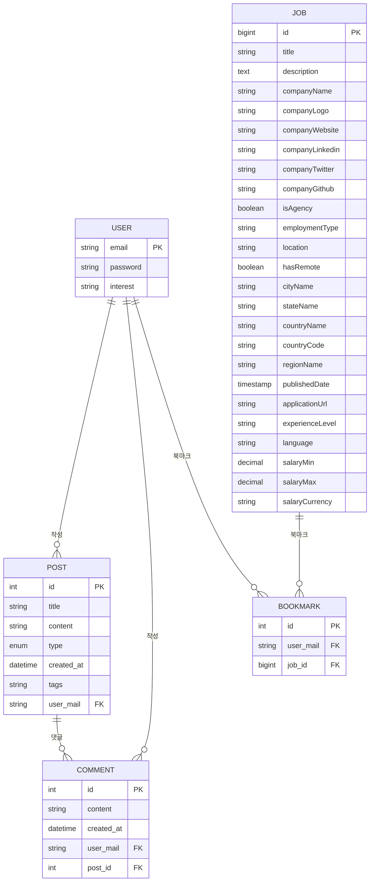

# WWW_BE 프로젝트 ERD (Entity Relationship Diagram)

## 데이터베이스 스키마

## 엔티티 상세 설명

### 1. User (사용자)

- **Primary Key**: `email` (string)
- **속성**:
  - `password`: 비밀번호
  - `interest`: 관심사
- **관계**:
  - 1:N → Post (사용자가 여러 게시글 작성)
  - 1:N → Comment (사용자가 여러 댓글 작성)
  - 1:N → Bookmark (사용자가 여러 직무를 북마크)

### 2. Post (게시글)

- **Primary Key**: `id` (auto increment)
- **속성**:
  - `title`: 제목
  - `content`: 내용
  - `type`: 게시글 타입 (enum: '경험', '자료')
  - `created_at`: 생성일시
  - `tags`: 태그
- **관계**:
  - N:1 → User (게시글 작성자)
  - 1:N → Comment (게시글의 댓글들)

### 3. Comment (댓글)

- **Primary Key**: `id` (auto increment)
- **속성**:
  - `content`: 댓글 내용 (최대 500자)
  - `created_at`: 생성일시
- **관계**:
  - N:1 → User (댓글 작성자)
  - N:1 → Post (댓글이 달린 게시글)

### 4. Job (직무)

- **Primary Key**: `id` (bigint)
- **속성**:
  - `title`: 직무 제목
  - `description`: 직무 설명
  - `companyName`: 회사명
  - `companyLogo`: 회사 로고 URL
  - `companyWebsite`: 회사 웹사이트
  - `companyLinkedin`: 회사 LinkedIn
  - `companyTwitter`: 회사 Twitter
  - `companyGithub`: 회사 GitHub
  - `isAgency`: 에이전시 여부
  - `employmentType`: 고용 형태
  - `location`: 위치
  - `hasRemote`: 원격 근무 가능 여부
  - `cityName`: 도시명
  - `stateName`: 주/도명
  - `countryName`: 국가명
  - `countryCode`: 국가 코드
  - `regionName`: 지역명
  - `publishedDate`: 게시일
  - `applicationUrl`: 지원 URL
  - `experienceLevel`: 경력 수준
  - `language`: 언어
  - `salaryMin`: 최소 급여
  - `salaryMax`: 최대 급여
  - `salaryCurrency`: 급여 통화
- **관계**:
  - 1:N → Bookmark (직무를 북마크한 사용자들)

### 5. Bookmark (북마크)

- **Primary Key**: `id` (auto increment)
- **관계**:
  - N:1 → User (북마크한 사용자)
  - N:1 → Job (북마크된 직무)

## 열거형 (Enum) 정의

### Type (게시글 타입)

- `EXPERIENCE`: 경험
- `FILE`: 자료

### Category (카테고리)

- `DEVELOPMENT`: 전산,컴퓨터
- `ELECTRICAL_ELECTRONIC`: 전기/전자
- `MANUFACTURING`: 생산/제조
- `CHEMICAL`: 화학
- `TEXTILE_APPAREL`: 섬유/의류
- `MECHANICAL_METAL`: 기계/금속
- `CONSTRUCTION_CIVIL`: 건설/토목
- `OFFICE_SERVICE`: 사무/서비스
- `MEDICAL`: 의료
- `ETC`: 기타

### CountryCode (국가 코드)

- 주요 국가들의 2자리 코드 (KR, US, JP, CN 등)

## 주요 특징

1. **사용자 중심 설계**: 이메일을 Primary Key로 사용하여 사용자 식별
2. **계층적 게시글 구조**: Post → Comment 구조로 게시글과 댓글 관리
3. **직무 정보 시스템**: 상세한 직무 정보와 회사 정보 관리
4. **북마크 기능**: 사용자가 관심 있는 직무를 북마크할 수 있는 기능
5. **CASCADE 삭제**: 사용자 삭제 시 관련된 모든 데이터 자동 삭제
6. **다국가 지원**: 국가 코드와 지역 정보를 통한 다국가 직무 정보 관리
