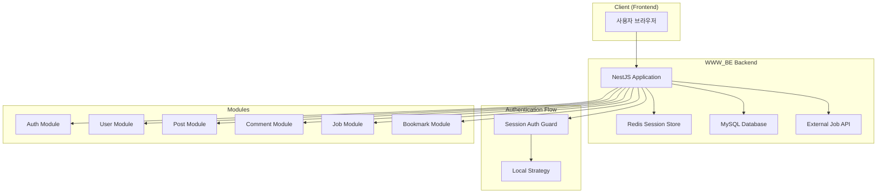
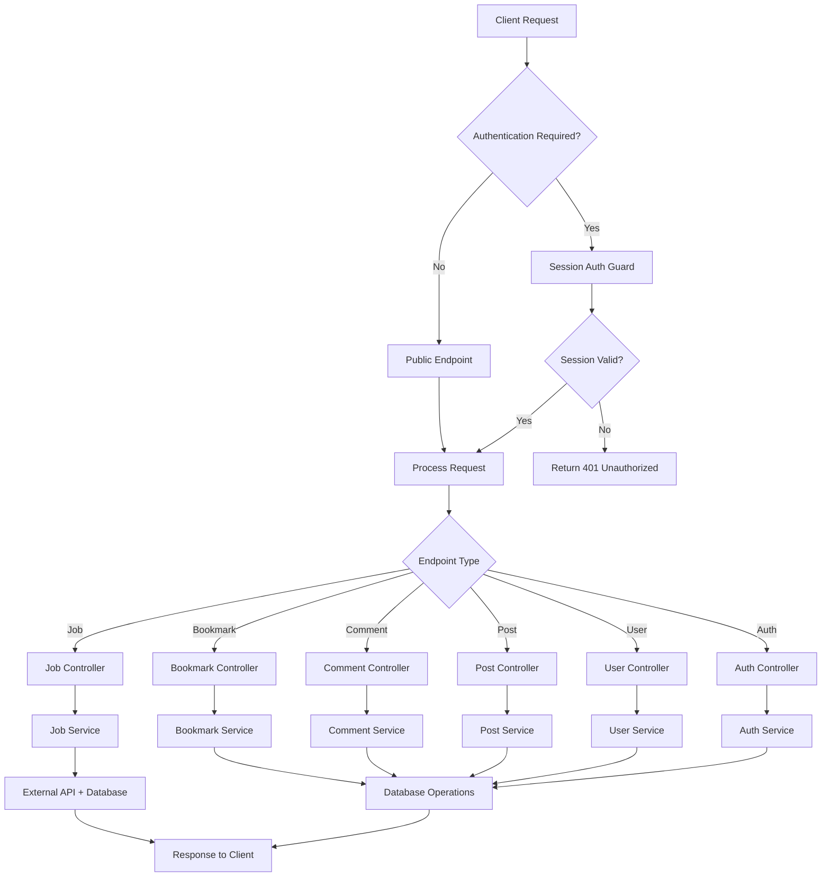
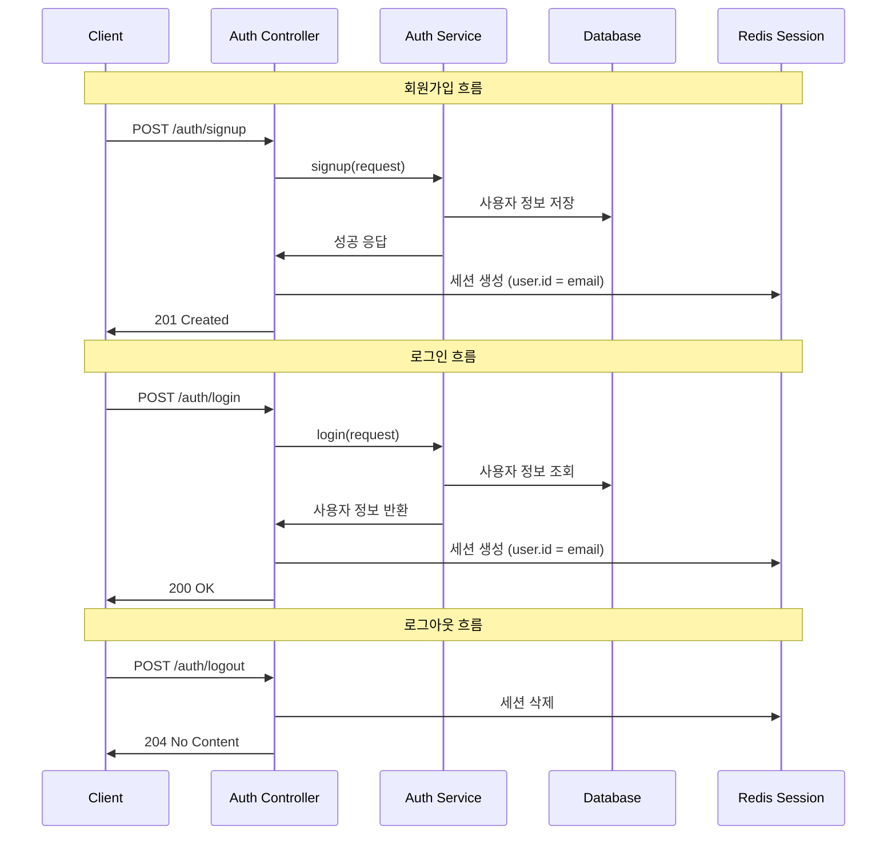
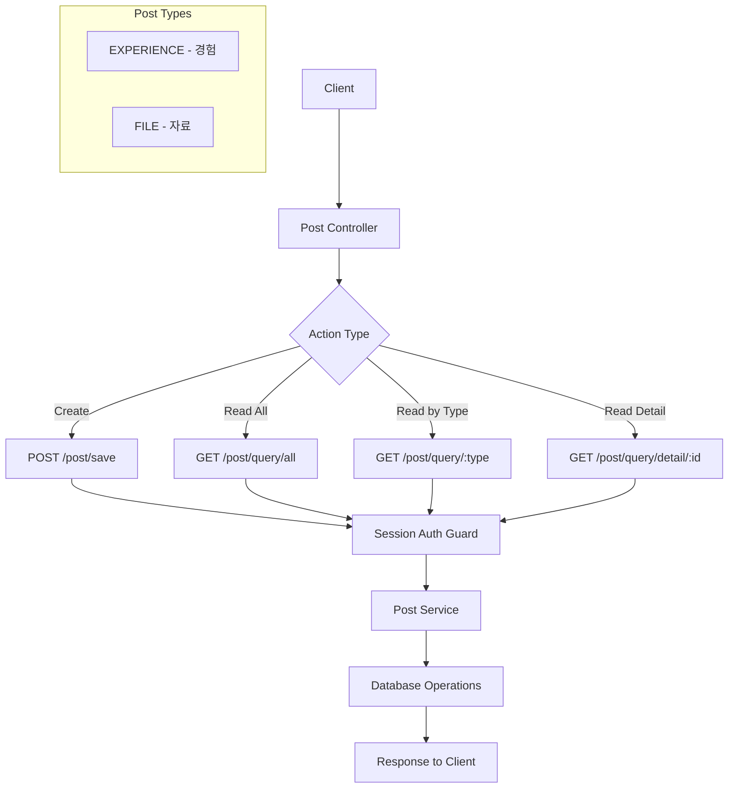
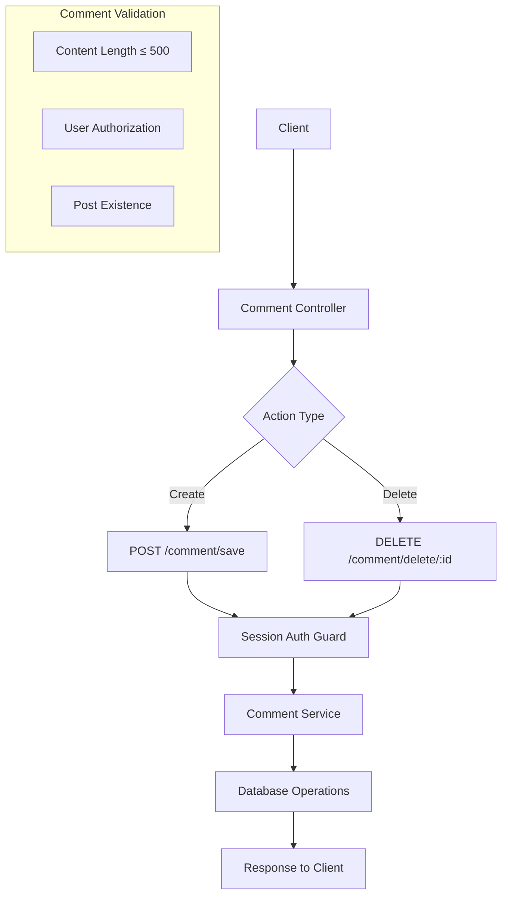
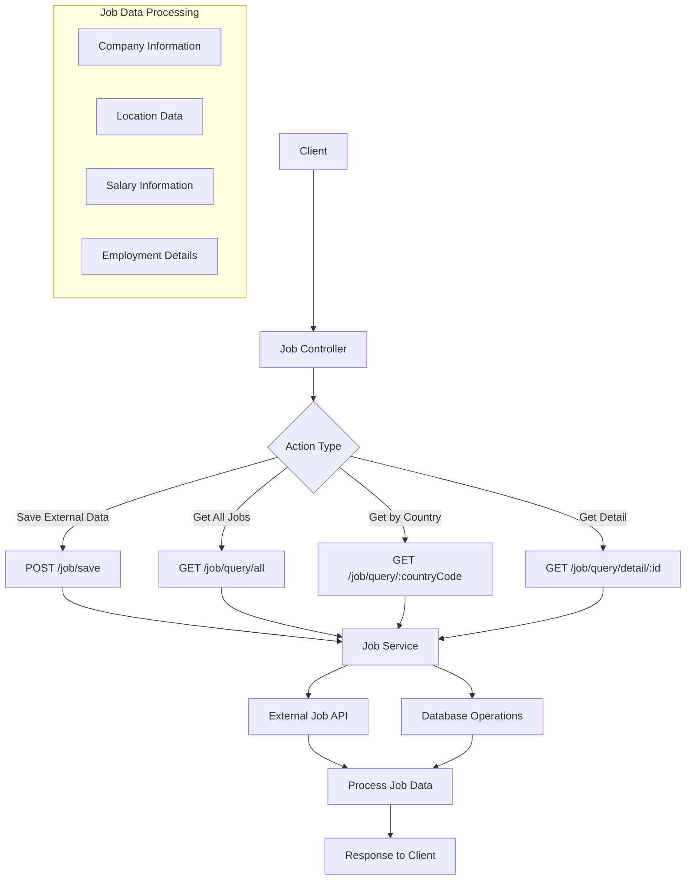
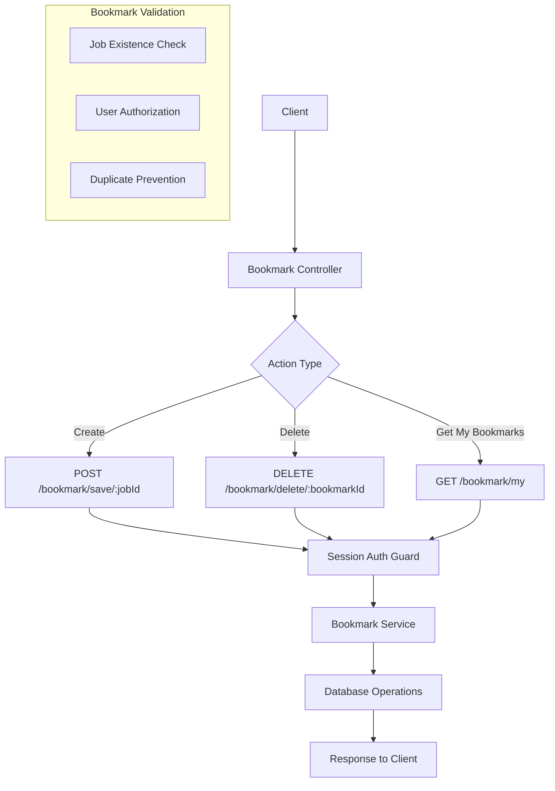
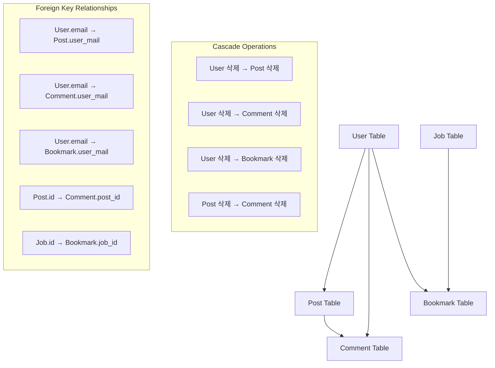
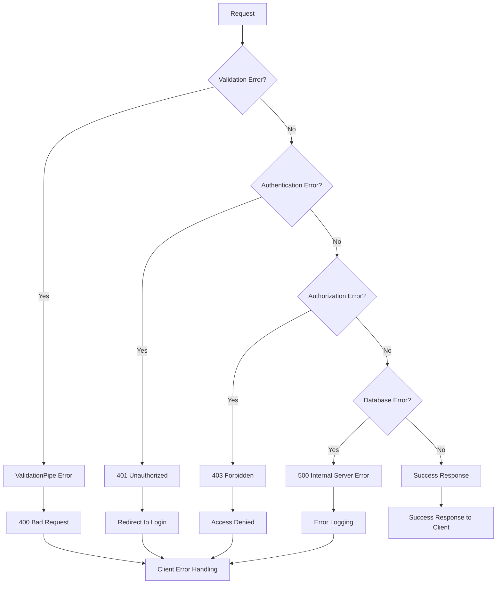

# WWW_BE 프로젝트 전체 흐름도

## 시스템 아키텍처 흐름도

## API 엔드포인트 흐름도

## 사용자 인증 흐름도

## 게시글 관리 흐름도

## 댓글 관리 흐름도

## 직무 정보 관리 흐름도

## 북마크 관리 흐름도

## 데이터베이스 연관 관계 흐름도

## 에러 처리 흐름도

## 주요 특징

1. **세션 기반 인증**: Redis를 사용한 세션 관리
2. **가드 기반 보안**: SessionAuthGuard로 보호된 엔드포인트
3. **모듈화된 구조**: 각 기능별로 독립적인 모듈 구성
4. **외부 API 통합**: 직무 정보를 외부 API에서 가져와서 저장
5. **CASCADE 삭제**: 데이터 무결성을 위한 자동 삭제 처리
6. **검증 파이프**: 요청 데이터의 자동 검증
7. **CORS 설정**: 프론트엔드와의 통신을 위한 CORS 설정
